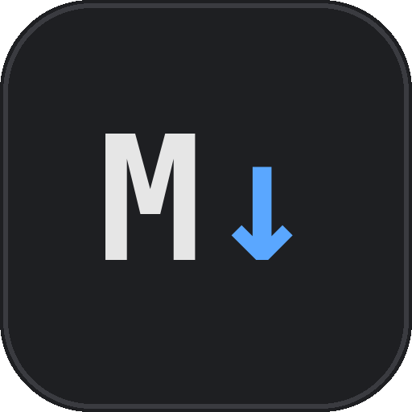
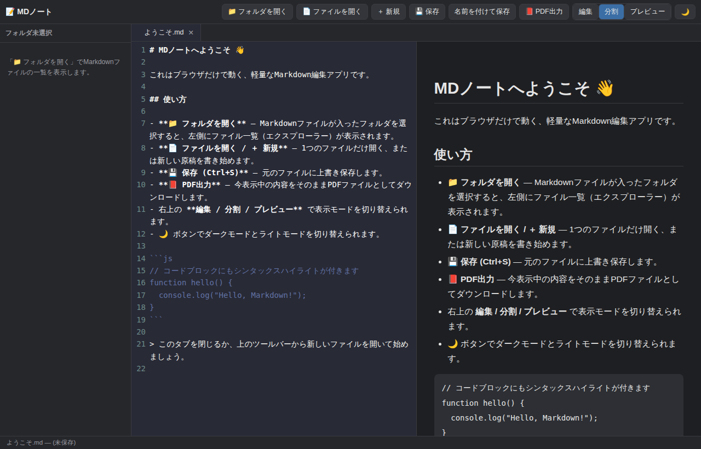

<div align="center">



# MDNote（MDノート）

**インストール不要・Python不要・VSCode不要。**
ブラウザだけで動く、軽量な Markdown 編集アプリ。

</div>

<p align="center">
  
</p>

## これは何？

普段 VSCode ＋ Markdown→PDF 変換の拡張機能で `.md` ファイルを書いていたけれど、VSCode 側の調子が悪く（Python 実行ボタンが動かない、など）、そこに依存しない Markdown 専用の軽量アプリが欲しくて作ったツールです。

- Markdown の**編集・プレビュー・PDF出力**が1つのアプリで完結
- VSCode のような**フォルダエクスプローラー**付き
- **シンタックスハイライト**・**ダークモード**対応
- **完全オフライン動作**（通信は一切行わない）
- サーバー・Python・Node.js のインストール一切不要

## 2つの配布形態

このリポジトリには、性質の異なる2つの実行方式を用意しています。用途に応じて選んでください。

| | 軽量版（ブラウザ間借り方式） | Electron版（完全スタンドアロン） |
|---|---|---|
| 起動ファイル | `start_mdnote.exe` / `.bat` / `.command` | `MDNote.exe`（別途ビルドが必要／[Releases](#electron版のビルド方法)参照） |
| サイズ | 約1.6MB | 約150〜360MB |
| 起動の仕組み | PC に入っている Chrome か Edge を `--app` モードで裏から呼び出す | Chromium エンジンをアプリ自体に内蔵。ブラウザに一切依存しない |
| メリット | 圧倒的に軽い・起動が速い | VSCode と同じ方式。ブラウザの有無やバージョンに左右されない、正真正銘の単体アプリ |
| デメリット | 内部的には Chrome/Edge を使っている（Windows なら標準搭載の Edge が使われることが多い） | ファイルサイズが大きい／署名なし実行ファイルなので初回 SmartScreen 警告が出る |

普段使いには軽量版で十分ですが、「完全に独立したアプリとして使いたい」「配布先に Chrome/Edge が入っているか分からない」といった場合は Electron 版を選んでください。

## 使い方

### 起動

- **Windows（軽量版）**: `start_mdnote.exe` をダブルクリック（`start_mdnote.bat` でも同じ動作をします）
- **Mac（軽量版）**: `start_mdnote.command` をダブルクリック（初回は右クリック→「開く」が必要な場合があります）
- **Electron版**: ビルド後にできる `MDNote.exe`（Windows）をダブルクリック

いずれもアドレスバーやタブのない、独立したウィンドウとして起動します。

> 軽量版はどちらも署名なしの実行ファイルです。初回起動時に Windows の「WindowsによってPCが保護されました」という警告が出た場合は、「詳細情報」→「実行」で起動できます。

### 基本機能

| 操作 | 説明 |
|---|---|
| 📁 フォルダを開く | 選んだフォルダの中身をツリー表示（VSCode 風）。クリックで各階層を開閉できます |
| 📄 ファイルを開く / ＋ 新規 | 単体のファイルを開く、または新規原稿を作成 |
| 💾 保存（`Ctrl+S`） | 開いた元のファイルへ直接上書き保存 |
| 名前を付けて保存（`Ctrl+Shift+S`） | 別名で保存 |
| 📕 PDF出力 | 表示中の内容をそのまま PDF としてダウンロード（印刷ダイアログを介さない） |
| 編集 / 分割 / プレビュー | 表示モードの切り替え |
| 🌙 / ☀️ | ダークモード・ライトモードの切り替え |
| `Ctrl+O` | ファイルを開く |
| `Ctrl+N` | 新規ファイル |

複数ファイルをタブで開いておけて、タブごとに独立した undo 履歴を持ちます。

### フォルダを開く際の注意

Chrome/Edge の仕様上、**デスクトップ・ドキュメント・ダウンロードフォルダなど「特別扱いされる場所」はフォルダごと直接開けません**（`システムファイルが含まれているため、file:/// はこのフォルダを開くことができません` というエラーが出ます）。これはこのアプリの不具合ではなく、ブラウザ側のセキュリティ制限です。

対処法: それらのフォルダの中に**サブフォルダ**を作り、そのサブフォルダを開いてください。

### 保存の仕組みについて

Chrome / Edge では [File System Access API](https://developer.mozilla.org/ja/docs/Web/API/File_System_API) を使い、選択したファイルに直接上書き保存します。この API に対応していないブラウザ（Firefox / Safari など）で開いた場合は、保存のたびにダウンロードフォルダへ新規ファイルとして書き出されます。

### PDF出力について

`html2canvas` でレンダリング結果をキャンバスに描画してから PDF に埋め込む方式のため、**日本語を含め文字化けなく確実に出力できる**一方、PDF内のテキストは画像化されており選択・検索はできません（見た目重視・確実性重視のトレードオフです）。

## 技術構成

すべてクライアントサイドの JavaScript のみで完結しており、サーバーや外部通信は一切ありません。

- **エディタ**: [CodeMirror 5](https://codemirror.net/5/)（Markdown / JavaScript / Python / XML / CSS / Shell / SQL / YAML などのシンタックスハイライトに対応、テーマは Dracula）
- **Markdown パーサー**: [marked](https://marked.js.org/)（GFM 準拠）
- **サニタイズ**: [DOMPurify](https://github.com/cure53/DOMPurify)（プレビューHTMLのXSS対策）
- **PDF生成**: [html2pdf.js](https://github.com/eKoopmans/html2pdf.js)（html2canvas + jsPDF）
- **Electron版**: [Electron](https://www.electronjs.org/) 43

## フォルダ構成

```
md-editor-app/
├── index.html              # アプリ本体（画面構成）
├── style.css                # 見た目（ダーク／ライトテーマ含む）
├── app.js                   # アプリのロジック（ファイル操作・エディタ・PDF出力など）
├── libs/                    # 同梱ライブラリ（CodeMirror / marked / DOMPurify / html2pdf.js）
├── start_mdnote.exe          # 軽量版ランチャー（Windows・実行ファイル／推奨）
├── start_mdnote.bat          # 軽量版ランチャー（Windows・バッチファイル代替）
├── start_mdnote.command       # 軽量版ランチャー（Mac）
├── README.txt                # 配布フォルダ同梱用の簡易説明（テキスト版）
├── README.md                  # このファイル
├── docs/                      # README用の画像
├── electron-app/              # Electron版のソース一式（下記参照）
├── electron-version/          # 展開済みのElectron版本体（.gitignore対象／未コミット）
└── _electron_download/        # Electron版の分割ダウンロード用データ（.gitignore対象／未コミット）
```

## Electron版のビルド方法

`electron-app/` にソース一式が入っています。自分でビルドし直したい場合は以下の手順です。

```bash
cd electron-app
npm install --save-dev electron-packager

# Windows向けにビルド（Linux/Mac上でビルドする場合、アイコンや
# バージョン情報を埋め込むには Wine が必要です）
npm run package-win
```

ビルドが成功すると `electron-app/dist/MDNote-win32-x64/MDNote.exe` が生成されます。

### Windows以外向けにビルドする場合

`package.json` の `package-win` スクリプトを参考に、`--platform` を `darwin`（Mac）や `linux` に変更すれば、それぞれの OS 向けにビルドできます。

```bash
npx electron-packager . MDNote --platform=darwin --arch=arm64 --electron-version=43.4.1 --out=dist --overwrite
```

## 既知の制限事項

- File System Access API（フォルダを開く・上書き保存）は Chrome / Edge などの Chromium系ブラウザのみ対応
- デスクトップ・ドキュメント・ダウンロードフォルダなど特定のフォルダは直接開けない（[上記参照](#フォルダを開く際の注意)）
- PDF出力のテキストは画像化されており、選択・検索はできない
- 軽量版・Electron版とも実行ファイルは自己署名していないため、初回起動時にOSの警告が表示される

## ライセンス

個人利用を目的に作成したツールです。ライセンスは特に設定していません。必要に応じて追加してください。
